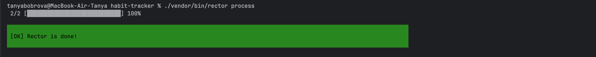
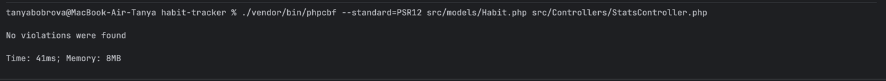
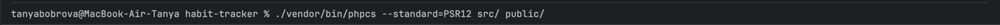
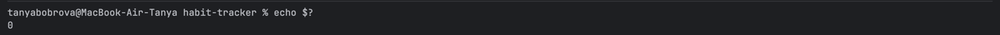

# Отчёт по миграции проекта ТРЕКЕР ПРИВЫЧЕК

## Какие проблемы были обнаружены при анализе

- Критических проблем совместимости с PHP 8.5 не обнаружено.

## Какие изменения были внесены автоматическими инструментами

- Rector автоматически обработал файл `public/index.php`.
- Rector добавил тип возвращаемого значения `: void` для анонимных функций там, где это было уместно.
- PHPCBF автоматически исправил ошибки форматирования.

## Какие изменения были внесены вручную

- В `composer.json` версия PHP изменена на `>=8.5`.
- В `App\Models\Habit::findById()` добавлен атрибут `#[\NoDiscard]`.
- В `App\Controllers\StatsController` для работы с массивом статистики использованы новые функции PHP 8.5: `array_first()` и `array_last()`.
- Выполнена проверка запуска проекта после миграции.

## Скриншоты

### Вывод Rector

### PHPCBF после исправления

### Итоговая проверка PHPCS

### Код возврата после PHPCS

