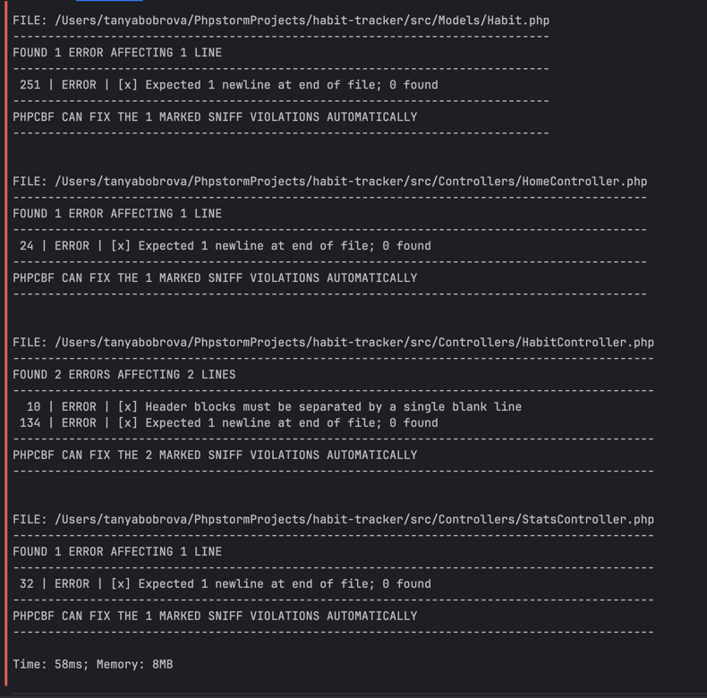

# migration_report.md

## Какие проблемы были обнаружены при анализе

При анализе проекта я проверила, что его можно запускать на PHP 8.5 и что требования к версии PHP и зависимостям указаны корректно в конфигурации проекта. Я также обратила внимание на стиль кода, единообразие оформления, обработку маршрутов и URI, чтобы не было разнобоя в подходах и потенциальных проблем при развитии приложения.

Были выявлены отдельные места с неоднородным стилем, возможными предупреждениями по стандартам кодирования и участки логики, которые можно упростить. Кроме того, потребовалось удостовериться, что маршруты и пути обрабатываются одинаково во всех частях приложения, чтобы избежать ошибок при переходе на новую версию PHP.

## Какие изменения были внесены автоматическими инструментами

Для проверки и частичной автоматической миграции кода я использовала инструменты PHP_CodeSniffer и Rector. PHP_CodeSniffer помог найти несоответствия стандартам оформления кода и стилевым правилам, а также подсветил потенциально проблемные места, связанные с качеством кода и единообразием написания.

Rector был использован для автоматического обновления части конструкций под актуальные практики и версию PHP. Он предложил и применил изменения, связанные с упрощением выражений, использованием более современных подходов и устранением некоторых устаревших приёмов. После запуска этих инструментов код стал более ровным по стилю и лучше подготовленным к работе на PHP 8.5.

## Какие изменения были внесены вручную

Часть изменений я сделала вручную, потому что автоматические инструменты только подсветили возможные проблемы, но не переписали код сами. Я прошлась по таким местам и исправила их так, чтобы поведение приложения не изменилось, а код стал понятнее.

Во‑первых, я упростила некоторые участки логики в контроллерах: убрала лишнее дублирование, сделала проверки более явными и сгруппировала связанные действия рядом. Это сделало обработку запросов и переходов по страницам более прозрачной при чтении кода.

Во‑вторых, я привела обработку маршрутов и URI к единому виду. Маршруты описаны одинаково, а пути нормализуются перед сопоставлением, чтобы не было разницы между похожими вариантами URL. Это помогло сделать маршрутизацию более предсказуемой и удобной для дальнейшей поддержки.

В‑третьих, я вручную добавила использование новых возможностей PHP 8.5 там, где это было уместно:
- использовала дополнительные функции для работы с массивами (например, для получения первого и последнего элемента списка статистики) вместо ручной работы с индексами;
- добавила атрибуты к тем методам, результат которых важно не игнорировать, чтобы явно подсказать это на уровне кода.

Все эти изменения были сделаны вручную после анализа подсказок от инструментов и кода приложения.

### PHPCS до миграции

### PHPCS после миграции

### Rector после миграции

